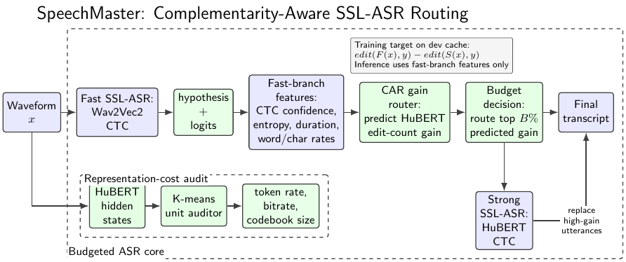
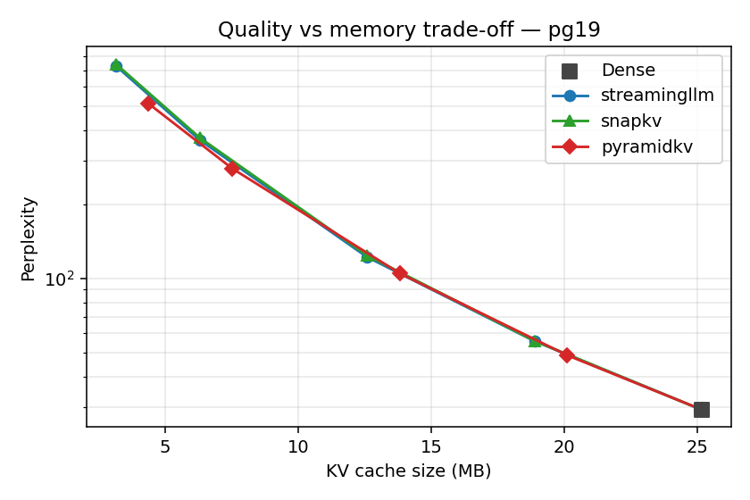
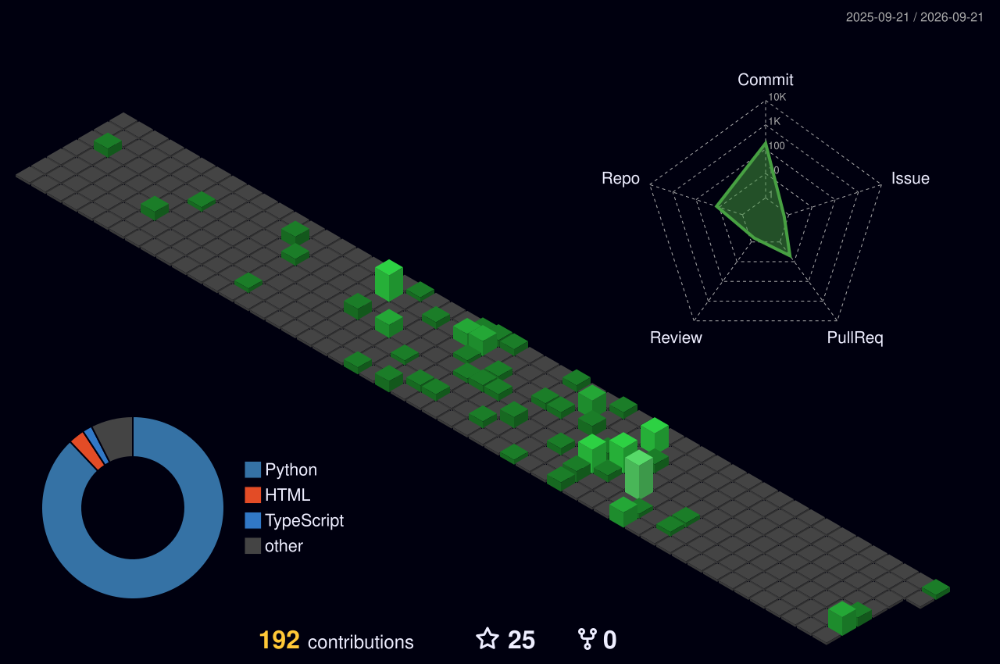

# Hi, I'm Zihang Zhou 👋

### Reliable LLM Agents · Agent Evaluation · Reproducible AI Systems

Undergraduate at the [School of Artificial Intelligence, Shanghai Jiao Tong University](https://ai.sjtu.edu.cn/), building AI systems that can be **tested, verified, and reproduced**.

## 👨‍💻 About Me

- 🎓 **Undergraduate (Junior)** at SJTU School of Artificial Intelligence
- 🎓 **Research Intern at Microsoft Research Asia (MSRA) in Shanghai**
- 🔍 Interested in Self evolving agents & RSI, reliable agents, repository understanding, and scientific AI
- 🧪 I care the definition of the capability of an agent and about the gap between *"the agent claims success"* and *"the task actually works"*
- 🏅 **National Scholarship** recipient (Top 0.5%, 2025)
- 🚀 Admitted to university one year early through Gaokao (Top 0.05% in Jiangsu)

## 🚀 Selected Projects

	

  
	

	<h3><a href="https://github.com/Zi-hang-Zhou/SetupX">⚙️ SetupX — Experience-Driven Repository Setup</a></h3>
	
An LLM-powered multi-agent system that configures software repositories inside Docker using reusable XPU knowledge, speculative execution with rollback, and independent adversarial verification.

	

		
		
		
		
	

<table>
	<tr>
		<td width="50%" valign="top">
			<h3 align="center"><a href="https://github.com/Zi-hang-Zhou/Speechmaster">🎙️ SpeechMaster</a></h3>
			
			
A reproducible, budget-aware framework for self-supervised speech recognition. It combines fast and strong SSL recognizers with complementarity-aware routing and representation-compression analysis.

			

				
				
			

		</td>
		<td width="50%" valign="top">
			<h3 align="center"><a href="https://github.com/Zi-hang-Zhou/NLP-project-work">🧠 KV Cache Compression</a></h3>
			
			
A reproducible comparison of StreamingLLM, SnapKV, and PyramidKV on Pythia-70M, covering perplexity, memory usage, latency, and long-context trade-offs.

			

				
				
			

		</td>
	</tr>
	<tr>
		<td width="50%" valign="top">
			<h3 align="center"><a href="https://github.com/Zi-hang-Zhou/ms-ms-pred-annotations">🧬 MS/MS Annotation Platform</a></h3>
			
A local web application for blind and model-assisted mass-spectrometry structure annotation, with per-peak evidence, progress tracking, and exportable results.

			

				
				
			

		</td>
		<td width="50%" valign="top">
			<h3 align="center"><a href="https://github.com/Zi-hang-Zhou/Repo2run-XPU">🛠️ Repo2run-XPU</a></h3>
			
LLM-assisted repository reproduction with reusable execution experience, knowledge retrieval, parallel processing, and containerized validation.

			

				
				
			

		</td>
	</tr>
</table>

## 🔬 Research Interests

- **Reliable LLM Agents & Tool Learning** — long-horizon decision making, self-verification, and failure-aware control
- **Code & Repository Understanding** — automatically configuring and reproducing real-world software repositories
- **Agent Evaluation** — execution-based benchmarks and adversarial checks that separate claims from verified outcomes
- **Scientific AI** — combining structured data, code, and natural language for scientific workflows

## 🧰 Languages & Tools

	
	&nbsp;
	
	&nbsp;
	
	&nbsp;
	
	&nbsp;
	
	&nbsp;
	
	&nbsp;
	

## 📈 GitHub Activity

<!-- Generated daily by .github/workflows/profile-3d.yml after the first successful workflow run. -->

	Open to research collaboration and reproducible AI projects.

